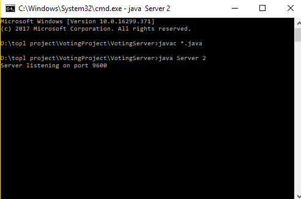
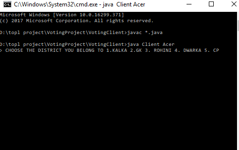
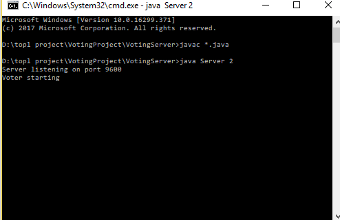
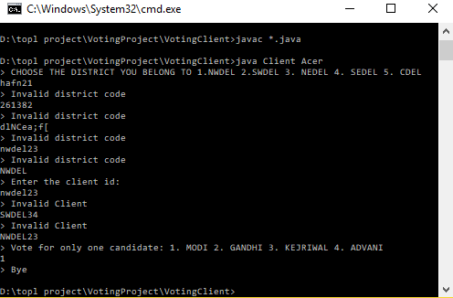
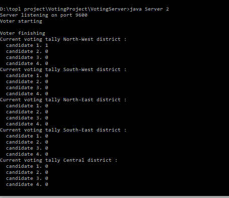
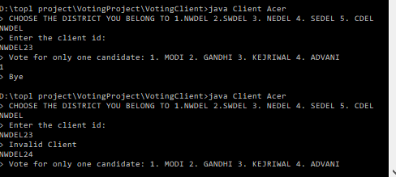
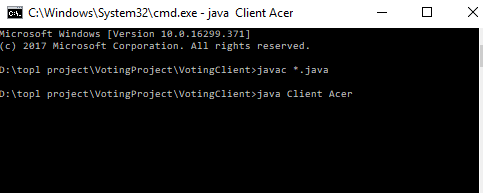

# Digital-Voting-System

This is a mini project which demonstrates the working of an electronic voting machine, digitally. This is a chat server application project where the clients, i.e the voters interact with the the server (ie. the voting machine) in a protected environment server. In this project each voter has a unique voter ID, that means that each voter ID when entered will be recorded and the same voter cannot vote again. Also, the tally chart available at the server side counts the number of clients voted at the real time and the rest of the remaining clients after each voter cycle. In this way, it helps the server know that how many voters have been missing the elections. This is an efficient way to find out that how many people haven’t voted and this can allow the electoral board to launch a survey asking people the reasons of not voting in elections and generating better election strengths in the next election. 

This project also provides a flexibility at the server side that lets the server decide how many clients can connect to it at a single time frame simultaneously and that to in real time. The client machine is authenticated, that means that a client cannot connect to a server till it enters the computer name in the network that is a computer machine acts as a signature between the client and server machines. This project comprises of five major districts of a city and each district comprises of a population of fifty adults having a unique voter ID. This project has a scope of increasing the population as well as the number of districts and allowing different servers to be present in different set of districts so that a huge population can be catered.

The voting machine contains votes of 5 different districts where each district contains 50 adult people:

-	One to one communication between client and server. The server can communicate with a client opened in a separate window and exchange of messages occurs by generating a socket connection between the client and server.
-	A Client can vote ONLY ONCE irrespective of the district he/she belongs to. There are five districts which allow the adults to vote but each voter can log into the voting system only once. This is possible by providing a unique voter ID to each voter with respect to the district he/ she belongs to. Once voting with that voter ID is completed and recorded then the voting result for that voter cannot be changed.
-	A Tally chart is maintained which adds each of the votes given in every district. This chart generates a cumulative result by providing the total sum of votes each candidate has received after every client voter cycle. This tally chart is used to generate a step wise result and in the end the total number of votes is displayed when the last voter has finished voting.
-	This system provides a unique way to find out how many voters have not voted. After every tally result, the tally will display the total number of client voters that have not voted till yet. This will help the system analyse the strength of voters that were present in elections. This study can be used to generate survey of why people are not coming to vote during the elections.

Following Steps are required to compile and run the Server and Client:
1. Compile both the files in VotingProject folder, that is VotingClient and VotingServer.
  
        javac *.java
2. Open three command prompts.
3. In the first prompt, go to VotingProject/VotingServer and run Server.

        java Server <No. of clients you wish to take vote from>
        
4. In the other two command prompts run the clients by adding the machine name. (Remember to connect the compuers in the same network)

        java Client <Computer-name>

Here are the implementation details of the project:
 

Figure 1 : Server ready to accept connections for atmost 2 clients at a time 

Figure 2(a) : Client Acer connecting with server and voter is displayed with a menu driven program asking its district 

Figure 2(b): When the client connects server gives a message as “Voter Starting”

 

Figure 3(a) : From the menu driven districts you have to selct only one district and the value choosed is case sensitive. Then after writing the ditrict code, it asks for client voter ID and here also Client should write the complete case senstive ID of its district only and not of any other district.
Then after entering the client unique voter ID there is the list of the candidates standing from that district among which you choose only one and after that a message “Bye” comes which allows the program to terminate itself.

Figure 3(c): After a particular voting cycle of client 1, this tally chart is shown depicting the casted vote and its district.

 

Figure 4 : Depicting that same client who has voted once can not vote again.

Figure 5: Depicting that since the server had allowed only two client application to run at a time the third Client will not get entry to the chat server application.

## References
This code was adapted by Allen Tucker in Febuary 2005, out of the programs downloaded from [The Java Tutorial](http://java.sun.com/docs/books/tutorial/networking/sockets/clientServer.html)
